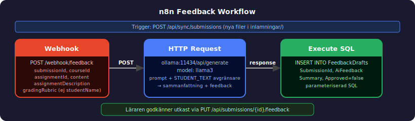
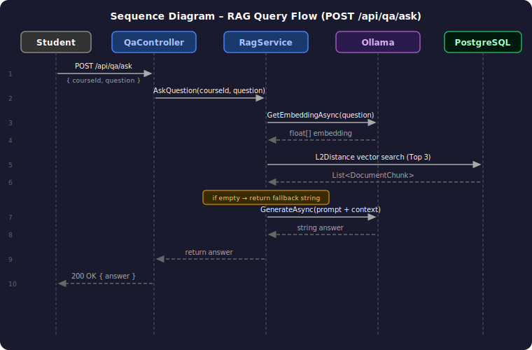
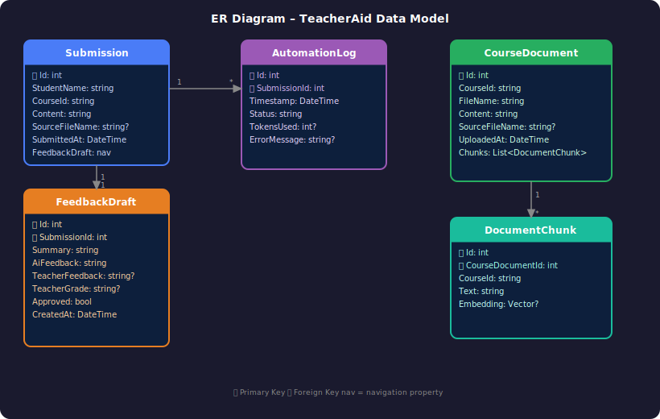

# Lösningsbeskrivning – TeacherAid

## 01. Problemet kunden hade

Anna Lindqvist är lärare på Yrkesakademin med tre kurser per termin och cirka 30 studenter per klass. Hon hade tre sammanlänkade problem:

**Feedback på inlämningar** var det mest akuta. Med 30 studenter per kurs och begränsad tid fick de flesta studenter tre rader och en bokstav — inte den substantiella feedback de förtjänade. Anna upplevde själv att det var orättvist men såg ingen annan utväg utan att jobba helger.

**Repetitiva studentfrågor** tog oproportionerligt mycket tid. Samma frågor dök upp om och om igen i Slack och mejl, och varje svar krävde hennes uppmärksamhet trots att svaret var identiskt.

**Kursmaterialproduktion** skalade inte. Skolan skickade in nya YH-ansökningar kontinuerligt, och när en ansökan gick igenom skulle kursen byggas från grunden. Befintligt material kändes föråldrat innan Anna hunnit uppdatera det, och övningarna var i princip identiska år från år — bara siffrorna byttes ut.

Det underliggande problemet var att Anna inte kunde skala sin pedagogik utan att tappa kvalitet.

---

## 02. Vad lösningen gör

TeacherAid är ett AI-stött webbaserat verktyg för lärare på Yrkesakademin. Det låter läraren ta emot studentinlämningar, automatiskt generera feedbackutkast med hjälp av lokal AI, samt granska och godkänna utkastet i en separat vy innan det används.

Utöver feedbackhantering kan läraren ladda upp kursdokument som indexeras för RAG-baserad frågehantering — elever kan ställa anonyma frågor om kursmaterialet och få svar genererade av AI, utan att behöva logga in.

---

## 03. Backend i korthet

Systemet består av tre lager som samverkar:

**ASP.NET Core API (.NET 10)** hanterar all affärslogik och exponerar ett REST-API med JWT-autentisering för lärarens gränssnitt. Centrala tjänster:

- `RagService` — indexerar kursdokument i vektorformat och besvarar elevfrågor med RAG-mönstret (Retrieval-Augmented Generation)
- `OllamaLLMService` — kommunicerar med den lokala Ollama-instansen för både embedding och textgenerering
- `FolderSyncService` / `DocumentExtractorService` — hanterar synkronisering och extraktion av kursmaterial

**PostgreSQL med pgvector** används som databas. pgvector-tillägget möjliggör vektorsökning (L2-distans) direkt i databasen, vilket är kärnan i RAG-flödet.

**Ollama (Docker)** kör AI-modellerna lokalt — `llama3` för textgenerering och `nomic-embed-text` för embeddings. Ingen data skickas till externa tjänster.

---

## 04. n8n-workflow — vad det automatiserar

När läraren triggar feedbackgenerering för en inlämning anropas ett n8n-workflow via webhook. Workflowen:

1. Tar emot inlämningsdata (student, kurs, innehåll) via POST till `/webhook/feedback`
2. Skickar innehållet till Ollama (`llama3`) med en prompt som begär sammanfattning och konstruktiv feedback
3. Sparar det genererade utkastet i databasen (`FeedbackDrafts`) med `Approved = false`

Läraren kan sedan granska och godkänna utkastet via gränssnittet.

---

## 05. Diagram

### Systemflöde (n8n-workflow)

### RAG-frågeflöde (sekvensdiagram)

### Datamodell (ER-diagram)

---

## Val och avgränsningar

**Lokal AI med Ollama istället för molntjänst** — Ollama valdes framför t.ex. OpenAI av kostnadsskäl. Eftersom all AI-inferens körs lokalt i Docker tillkommer inga löpande API-kostnader, vilket är avgörande för en lärare med begränsad budget.

**En kurs (by design)** — Lösningen är medvetet begränsad till en enda kurs för att testa konceptet på en kontrollerad mängd data innan en fullskalig lösning med flera kurser och lärare övervägs.

**Anonyma elevfrågor utan inloggning** — Elevernas frågor är generella kursfrågor och ingen personlig data kopplas till dem. Det finns därmed inget behov av autentisering, och att slippa inloggning sänker tröskel för eleverna att använda tjänsten.

**Vad som valdes bort** — Två funktioner identifierades som viktiga men lämnades utanför scope i denna version: ordentlig bedömningsfeedback kopplad till kurskriterier (där AI specificerar hur varje elev uppnått respektive bedömningskriterium), samt möjlighet för läraren att ladda ner AI-genererat kursmaterial direkt som ett dokument.

---

## Kända begränsningar

- **Feedback visas inte på inlämningen** — AI-genererat feedbackutkast dyker inte upp direkt under inlämningen. Läraren måste manuellt kopiera över feedbacken.
- **Kursmaterial kan inte redigeras i gränssnittet** — det finns inget sätt att uppdatera eller ta bort uppladdade kursdokument via frontend.
- **Feedback kan inte redigeras direkt på sidan** — läraren kan inte justera AI-feedbacken inline.
- **Genererat kursmaterial kan inte exporteras** — läraren måste kopiera innehållet manuellt till en extern dokumenthanterare.
- **En kurs stöds (by design)** — systemet är avsiktligt begränsat till en enda kurs i nuvarande version.
- **Elever loggar inte in (by design)** — elever ställer anonyma frågor utan autentisering.
- **Chunking delar inte på meningar** — `ChunkText` splittar enbart på radbrytningar och kan producera chunks som överskrider maxstorleken.
- **Endast tre chunks används per fråga** — RAG-sökningen hämtar alltid exakt tre närmaste chunks oavsett relevans.
- **Embeddings cachas inte** — varje anrop genererar ett nytt embedding-anrop till Ollama.
- **Ingen felhantering för Ollama-timeout** — om Ollama är under uppstart kastar API:et ett ohanterat undantag.
